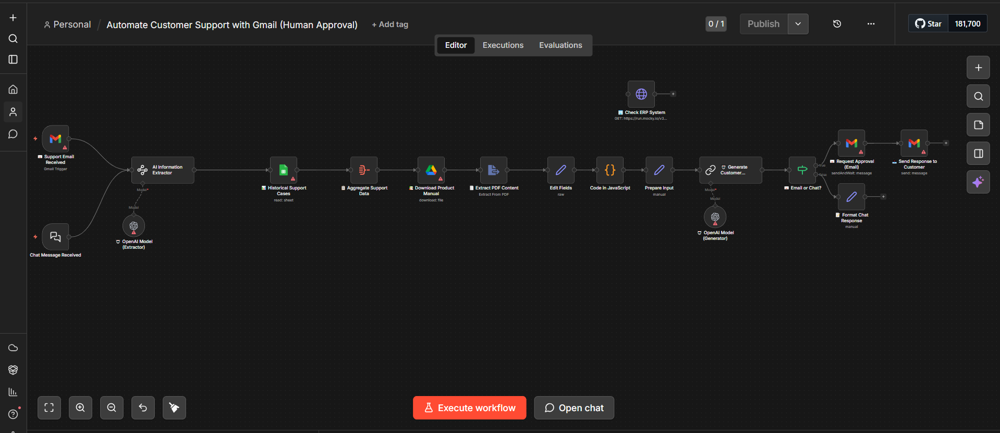
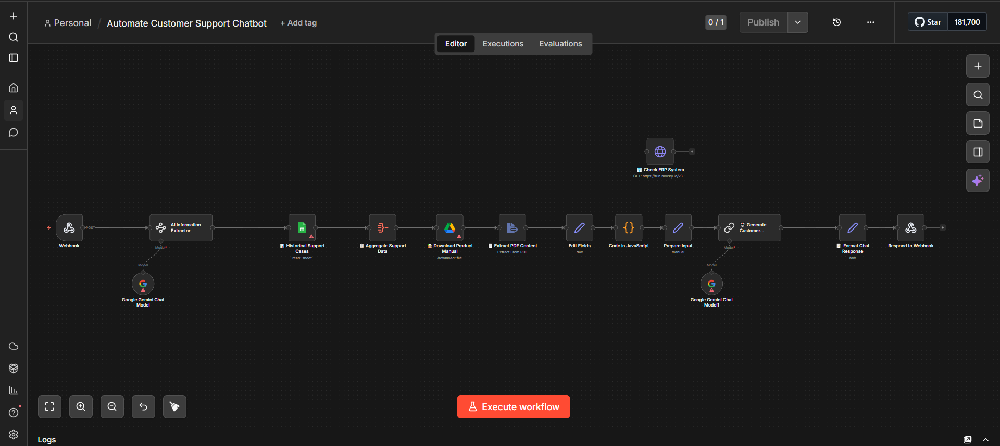

# 🔥 AI Customer Support Automation System

## 📌 Overview
This project is an AI-powered automation workflow designed to handle customer queries and generate intelligent responses using API-based integrations. It demonstrates how workflows can be automated using webhooks and AI services to build scalable support systems.

---

## ⚙️ Features
- 🤖 Automated response generation using AI APIs  
- 🔗 Webhook-based trigger system  
- ⚡ Real-time query processing  
- 📈 Scalable automation workflow  

---

## 🛠️ Tech Stack
- JSON-based workflow automation  
- AI APIs (Gemini / OpenAI or similar)  
- Webhooks  

---

## 🚀 How It Works
1. User sends a query  
2. Webhook triggers the automation workflow  
3. AI processes the input  
4. System generates and returns a response  

---

---

## 📸 Demo

---

## 💡 Use Cases
- Customer support automation  
- AI chatbots  
- Business workflow optimization  
- Automated query handling systems  

---

## 🧠 Key Learnings
- Designing automation pipelines using APIs  
- Integrating AI into real-world workflows  
- Using webhooks for event-driven systems  
- Structuring scalable automation logic  

---

## 🔗 Future Improvements
- Add frontend interface (React)  
- Deploy as a live API service  
- Integrate database for conversation history  
- Improve response accuracy with fine-tuning  

---

## 👨‍💻 Author
**Hassaan Ahmed**  
- GitHub: https://github.com/hasssaaannn  
- LinkedIn: https://linkedin.com/in/hassaanahmed-dev  

---
